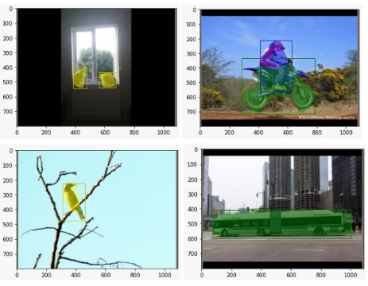

# MaskRCNN 
Implementation of MaskRCNN from scratch. This includes RPN Network, FasterRCNN and it's extension MaskRCNN. 

## Pipeline

## Results

Given Below are the steps to Run MaskRCNN and DeepSort
# To run MaskRCNN
The three Python Notebooks contain the 3 Blocks of MaskRCNN Network
- RPNHead
- BlockHead
- MaskHead

They can be run independently and do not require any additional dependencies. The given results in the notebook are based on our trained model.

## Steps to run any of the ipynb files
- Part A section of all the files is the functions needed to run the model. Run all code blocks in Part A
- After running Part A, Run Part B to train the model
- Part C contains the results of the model, if training has been completed then change path of the torch.load function to run trained model to obtain results.
